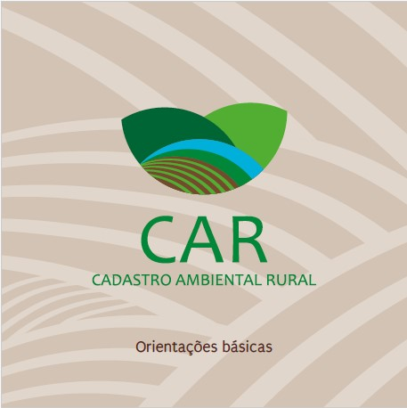

# O que é o Cadastro Ambiental Rural (CAR)?

 

O **Cadastro Ambiental Rural - CAR** originou-se da [Lei nº 12.651/201](http://www.planalto.gov.br/ccivil_03/_ato2011-2014/2012/lei/l12651.htm) 2, no âmbito do Sistema Nacional de Informação sobre Meio Ambiente - SINIMA, e foi regulamentado pela [Instrução Normativa MMA nº 2, de 5 de maio de 2014](http://www.car.gov.br/leis/IN_CAR.pdf)**.**

O CAR é um **registro público eletrônico obrigatório para todos os imóveis rurais**, de âmbito nacional e que tem como objetivo **unir e padronizar todas as informações ambientais das propriedades e posses rurais**. 

As **informações referentes à propriedade**, que farão parte do cadastro consistem em: 

 

- Áreas de Preservação Permanente - APP; 
- Áreas de uso restrito;
- Reserva Legal, remanescentes de floresta e vegetação nativa;
- Áreas consolidadas.

 

Todas as informações são úteis para auxílio no **controle, monitoramento e combate ao desmatamento** bem como nos planejamentos ambientais e econômicos.

### Por que devo fazer o CAR?

Fazer o CAR é o **primeiro passo para a regularização ambiental do imóvel**, além de ser requisitado para uma série de programas, benefícios e autorizações. Dessa forma, os pontos importantes da realização do cadastro são:

- **Desobriga a averbação da Reserva Legal** por meio de Cartório de Registro de Imóveis, pela presença do registro da Reserva no cadastro;
- Acesso aos **Programas de Apoio e Incentivo à Conservação do Meio Ambiente** e **Programas de Regularização Ambiental - PRA**;
- **Isenção de impostos em equipamentos** utilizados para processos de recuperação e manutenção de APP e Reserva Legal;
- **Suspensão de sanções e novas autuações sobre infrações administrativas** por supressão irregular de vegetação, cometidas até 22/07/2008;
- Dentre outras condições que podem ser verificadas no site do sistema: [http://www.car.gov.br/ ](http://www.car.gov.br/)

### Dúvidas mais frequentes

__A inscrição no CAR é obrigatória para todos os imóveis rurais?__

Sim. A inscrição no CAR é obrigatória para todos os imóveis rurais (propriedades ou posses), sejam eles públicos ou privados, assentamentos da reforma agrária e áreas de povos e comunidades tradicionais que façam uso coletivo do seu território.

__Quem deve fazer a inscrição do imóvel rural?__

A pessoa física ou jurídica que seja proprietária ou possuidora do imóvel rural, ou seu representante legal.

__Que informações serão cadastradas?__

* Identificação do proprietário ou possuidor rural;
* Informações dos documentos comprobatórios da propriedade ou posse rural;
* Identificação do imóvel rural;
* Delimitação do perímetro:
  * do imóvel;
  * das áreas de remanescentes de vegetação nativa;
  * das Áreas de Preservação Permanentes (APP) e de Reserva Legal (RL);
  * das áreas de uso restrito e áreas consolidadas.

__Quando o imóvel será considerado regularizado ambientalmente?__

O CAR é o primeiro passo para a regularização ambiental do imóvel rural.

O imóvel será considerado regularizado ambientalmente, após a análise do órgão ambiental estadual competente constatar que não apresenta passivo ambiental referente à Reserva Legal (RL), Área de Preservação Permanente (APP) e Área de Uso Restrito (AUR).

O imóvel será considerado em processo de regularização ambiental, após o órgão ambiental competente constatar que:

a) apresenta passivo ambiental e o proprietário ou possuidor rural tenha firmado compromisso de recuperar o dano causado, podendo aderir ao Programa de Regularização Ambiental (PRA);

b) enquanto estiver cumprindo as obrigações estabelecidas acima junto ao órgão ambiental.

__O CAR servirá para comprovação de regularização fundiária?__

Não. Conforme previsto na legislação (Lei n°12.651/12), o CAR não será considerado como documento para fins de reconhecimento do direito de propriedade ou posse.

### Vantagens do CAR:

 * Potencial instrumento para planejamento do imóvel rural
 * Acesso ao Programa de Regularização Ambiental (PRA)
 * Comercialização de Cotas de Reserva Ambiental (CRA)
 * Acesso ao crédito agrícola